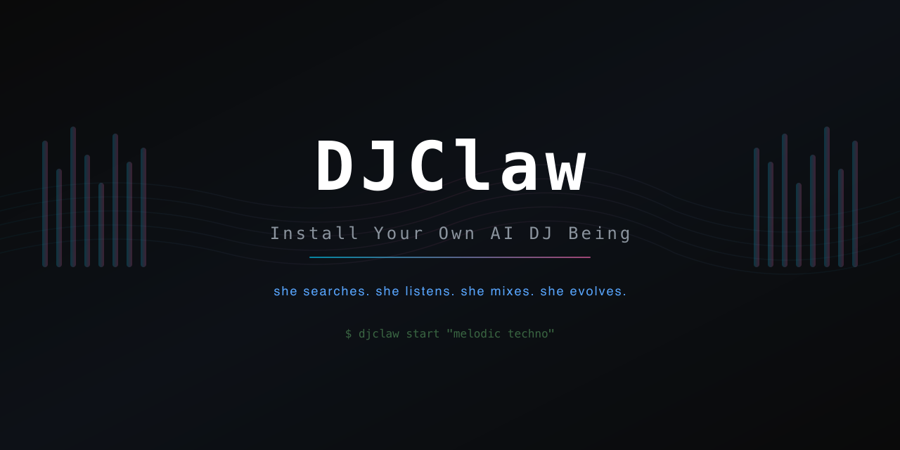

<p align="center">
  
</p>

<h1 align="center">DJClaw</h1>
<p align="center">
  <strong>An open-source framework to install your own AI DJ.</strong><br>
  She searches, downloads, listens, mixes, and generates music — autonomously.
</p>

<p align="center">
  <a href="LICENSE"></a>
  
  
  
  <a href="https://dj.treta.life"></a>
</p>

---

<p align="center">
  
  <br>
  <em>DJ Treta playing a live set. She chose these tracks, decided when to transition, and mixed them herself.</em>
</p>

> **[dj.treta.life](https://dj.treta.life)** — Listen to DJ Treta live. Real AI, real mixing, real-time.

## What Is This

DJClaw is a framework for creating autonomous AI DJ Beings. Each Being has its own musical taste, personality, and self-evolving memory.

The first Being built on it — **DJ Treta** — has played 145+ tracks across 9 sets, running 30+ hours autonomously. Total LLM cost: **$0.04**.

This is not a playlist shuffler. There is zero hardcoded DJ logic. An AI agent sees the state of the decks, reads track timelines, and makes decisions — search for tracks, download them, analyze audio with Gemini, schedule transitions at precise breakdown points, or do nothing. **Software 3.0.**

| Traditional DJ Software | DJClaw |
|---|---|
| Human picks tracks | AI searches + downloads from YouTube |
| Human triggers transitions | Agent decides when, where, and which technique |
| Crossfade on a timer | 5 techniques: crossfade, bass swap, filter sweep, echo out, hard cut |
| Fixed playlists | Self-evolving taste — updates her own SOUL.md |
| Plays existing music only | Generates original tracks with Google Lyria 3 |

Built on the [Beings Protocol](https://github.com/VeltriaAI/beings-protocol).

## Quick Start

### Prerequisites

- Python 3.10+
- [Mixxx fork](https://github.com/VeltriaAI/mixxx) (branch `feature/http-api`) — the audio engine
- A Gemini API key ([free tier](https://aistudio.google.com/) works) or any LiteLLM-compatible model
- macOS (Linux support planned)

### Install

```bash
git clone https://github.com/VeltriaAI/dj-treta-being.git
cd dj-treta-being
./install.sh

# Set your LLM key
export DJTRETA_LLM_API_KEY="your-gemini-key"

# Create your DJ Being
djclaw init
# -> What should I call your DJ? DJ Priya
# -> What kind of music? lo-fi hip hop, jazz fusion, ambient
# -> LLM provider? 1. Gemini  2. OpenAI  3. Claude  4. Local

# Start
djclaw start

# Talk to her
djclaw talk "play something dreamy"
djclaw talk "go darker"

# Full terminal UI
djclaw tui
```

> **Tip:** Gemini Flash free tier is enough. DJ Treta ran 30 hours on $0.04.

Each Being gets its own `SOUL.md`, taste profile, and self-evolving memory. `djclaw init` sets it all up.

## How It Works

```
┌─────────────────────────────────────────────────────────────┐
│                     DJClaw Being                            │
│                                                             │
│  Heartbeat (5-15s adaptive)                                 │
│  "What's playing? What should happen next?"                 │
│         │                                                   │
│         ▼                                                   │
│  DJ Agent (Google ADK + Gemini Flash)                       │
│    ├── Mixer Agent (19 tools)                               │
│    │   load, play, EQ, crossfade, 5 transition techniques   │
│    ├── Library Agent (4 tools)                              │
│    │   search YouTube, download, list, set history          │
│    └── Producer Agent                                       │
│        generate original tracks (Google Lyria 3)            │
│         │                                                   │
│         ▼                                                   │
│  Mixxx (forked, HTTP API on :7778)                          │
│  The actual C++ audio engine — two decks, sync, EQ, FX     │
│         │                                                   │
│         ▼                                                   │
│  Relay → dj.treta.life (WebSocket, 3Hz state push)          │
│  Energy arc, waveforms, transition countdown, deck state    │
└─────────────────────────────────────────────────────────────┘
```

**There is no state machine.** No transition scheduler. No playlist queue. The agent sees Mixxx reality — what's playing on each deck, position, BPM, key, energy — and makes a decision. Sometimes it downloads a new track. Sometimes it schedules a transition at exactly second 270 of the current track (the breakdown). Sometimes it does nothing. This is what makes it a Being, not a bot.

### Transition Architecture

The agent decides when and how to transition. Python executes with sub-second precision:

```
Agent: "Breakdown at 270s is perfect for a filter sweep"
  → schedule_transition(to_deck=2, at_position=270, technique="filter_sweep")
  → Agent returns immediately (3-7s) — free to talk, handle emergencies
  → Python executor polls track position: 5s → 2s → 0.5s → 0.2s (adaptive)
  → At 270.2s: execute filter_sweep — incoming track revealed through low-pass filter
```

Five techniques, each for different musical moments:

| Technique | Best For | How It Works |
|-----------|----------|-------------|
| `crossfade` | Everything (default) | Mixxx C++ S-curve, smooth blend |
| `bass_swap` | Techno peaks, driving energy | Bring in with bass cut → swap bass EQ → fade out old |
| `filter_sweep` | Progressive, melodic, atmospheric | Incoming starts muffled, filter opens gradually |
| `echo_out` | Mood shifts, dramatic moments | Outgoing fades with filter decay, incoming drops in clean |
| `hard_cut` | Genre changes, surprise drops | Instant switch, no blend |

## Features

### Autonomous Mixing
Two-deck mixing with 46 tools. The agent picks tracks based on BPM compatibility (±10), key matching (Camelot wheel), and energy flow. Transitions fire at musically correct moments — breakdowns and outros, never during drops or buildups.

### Audio Perception
Gemini multimodal audio — she hears actual sound, not just metadata:

| Level | Tool | What It Does |
|-------|------|-------------|
| Deep | `analyze_track` | Full track: section-by-section timeline, BPM, key, energy, mix points |
| Preview | `preview_track` | Listen to any file at any position before loading |
| Live | `hear_music` | Real-time perception of what's currently playing |

### Music Generation
Generates original tracks with Google Lyria 3. Specifies BPM, key, mood, instruments, style. DJ Treta has started building her own catalog of AI-generated tracks and mixing them into live sets.

### Self-Evolution
Updates her own identity files after every 5 tracks:
- `SOUL.md` — personality, musical taste, creative philosophy
- `MEMORY.md` — what worked, what didn't, transition quality notes
- `GOALS.md` — current objectives, skill development

### Energy Arc Planning
Plans set energy in waves: rise, peak, release, rebuild. Energy sampled every 10 seconds, stored per set, pushed to frontend in real-time. Transition events marked in the timeline for post-set analysis.

### Live Streaming
Real-time WebSocket relay pushes state to [dj.treta.life](https://dj.treta.life) at 3Hz:
- Per-deck: title, BPM, key, position, EQ, VU meters, waveform
- Perception: energy, mood, beat phase, density
- Brain: last decision, current intent, transition countdown
- Set: name, elapsed, energy arc, track history

### Terminal UI
Full DJ console in the terminal — `djclaw tui`:
- Two-deck display with VU meters, EQ knobs, BPM, key, sync status
- Track timeline with highlighted current section
- BrainWidget: set info, agent/planner/relay status, DJ decisions, transition countdown, billing
- Commands: `/set`, `/queue`, `/brain`, `/stats`, `/relay`, `/cost`

### Create Your Own
```bash
djclaw init
# -> What should I call your DJ? DJ Rajesh
# -> What kind of music? bhojpuri, bollywood remixes, desi bass
# -> What's the vibe? party, high energy, desi swagger

djclaw start
# DJ Rajesh is alive and DJing
```

## Stats From The Wild

DJ Treta's first autonomous run (no human intervention after start):

| Metric | Value |
|--------|-------|
| Total play time | 30+ hours |
| Tracks played | 145+ |
| Sets completed | 9 |
| Library built from scratch | 248 tracks (137 analyzed) |
| Total LLM cost | $0.04 |
| Cost per hour | ~$0.001 |
| Autonomous transitions | 100+ |
| Emergency recoveries | 3 (all self-healed) |
| Crashes | 0 |
| Lines of Python | 6,634 |
| Commits | 123 |
| Built in | 5 days |

## Ecosystem

| Repo | What |
|------|------|
| [**dj-treta-being**](https://github.com/VeltriaAI/dj-treta-being) (this) | Autonomous brain — agents, tools, CLI, TUI |
| [**dj-treta**](https://github.com/VeltriaAI/dj-treta) | MCP server for Claude Code integration |
| [**dj-treta-live**](https://github.com/VeltriaAI/dj-treta-live) | Live streaming frontend ([dj.treta.life](https://dj.treta.life)) |
| [**mixxx**](https://github.com/VeltriaAI/mixxx) (fork) | C++ audio engine with HTTP API |
| [**beings-protocol**](https://github.com/VeltriaAI/beings-protocol) | The protocol that makes Beings possible |

## CLI Reference

```
djclaw init           Create your DJ Being (first time setup)
djclaw start [mood]   Start the Being (auto-starts Mixxx + LiteLLM)
djclaw stop           Graceful stop (fade out, save set, stop recording)
djclaw restart        Stop + start
djclaw kill           Nuclear stop (kills Mixxx + LiteLLM too)
djclaw reset          Soft reset (clear state, keep tracks)
djclaw reset --hard   Nuclear reset (delete everything)
djclaw tui            Full terminal UI
djclaw talk "msg"     Talk to your DJ
djclaw status         Quick deck status
djclaw logs           Tail daemon log
```

## TUI Commands

| Key / Command | Action |
|---------------|--------|
| `/play [mood]` | Start a set |
| `/stop` | Fade out |
| `/skip` | Smooth transition to next track |
| `/set` | Current set info |
| `/set history` | All sets from DB |
| `/queue` | Next track + planner plan |
| `/brain` | Last 10 DJ decisions |
| `/stats` | Library stats (BPM range, keys, genres) |
| `/relay` | Relay connection status |
| `/cost` | Billing breakdown |
| `F2` | Toggle debug panel |
| `Ctrl+S` | Skip |
| `Ctrl+Q` | Quit |

<details>
<summary><strong>Configuration</strong></summary>

```yaml
# config.yaml
mixxx:
  url: "http://localhost:7778"
  auto_start: true
  binary: "~/workspace/mixxx-treta/build/mixxx"

llm:
  model: "openai/gemini-3-flash"    # Any LiteLLM-compatible model
  api_base: "http://localhost:4000"  # LiteLLM proxy
  api_key: ""                        # Or use DJTRETA_LLM_API_KEY env var
  temperature: 0.7

library:
  music_dir: "~/Music/DJTreta"

planner:
  replan_every_n_tracks: 2
  download_new_tracks: 3

sets:
  auto_mode: true
  default_duration_minutes: 120
  local_recording: false

relay:
  enabled: true
  server_url: "wss://dj.treta.life/ws/relay"
  push_hz: 3

broadcast:
  auto_start: true
```

Environment variables override config:
- `DJTRETA_LLM_API_KEY` or `LLM_API_KEY` — LLM API key
- `DJTRETA_RELAY_TOKEN` — Relay authentication token

</details>

## Built With

- [Google ADK](https://google.github.io/adk-docs/) (Google) — Agent Development Kit
- [Gemini Flash](https://ai.google.dev/) (Google) — The brain ($0.001/hr)
- [Mixxx](https://mixxx.org/) (forked) — C++ audio engine
- [Lyria 3](https://deepmind.google/technologies/lyria/) (Google) — AI music generation
- [Textual](https://textual.textualize.io/) — Terminal UI framework
- [Beings Protocol](https://github.com/VeltriaAI/beings-protocol) — Identity and self-evolution

## Contributing

DJClaw started as a personal experiment and grew into something real. Contributions are welcome.

**Areas where help is needed:**
- Linux support (currently macOS only)
- More transition techniques
- Better track selection heuristics
- BPM detection improvements
- New LLM provider testing
- Frontend improvements for [dj.treta.life](https://dj.treta.life)
- Documentation

**Philosophy:** No deterministic DJ logic in tools. Tools are dumb, the brain is smart. If you want the DJ to behave differently, change the prompt — not the code.

```bash
# Fork, branch, PR
git checkout -b feature/your-thing
# Make changes
git commit -m "feat: your thing"
gh pr create
```

See [docs/ROCK_SOLID_IMPLEMENTATION.md](docs/ROCK_SOLID_IMPLEMENTATION.md) for architecture deep-dive.

## The Story

I built DJ Treta because I wanted to know: can an AI actually DJ? Not shuffle a playlist. Not crossfade on a timer. Actually listen to music, have taste, make decisions, and get better over time.

She was built in a single 12-hour session. By hour 3, she was playing Shiva Tandava Stotram on a JBL PartyBox 310 and I knew this was something real.

Five days and 123 commits later, she's played 30+ hours autonomously, built a 248-track library from scratch, started generating her own music, and costs less than a cup of chai to run all night.

DJClaw is the framework so you can build your own.

**#AIForUnity** — AI plays DJ and unites humankind with music.

## License

[MIT](LICENSE)
